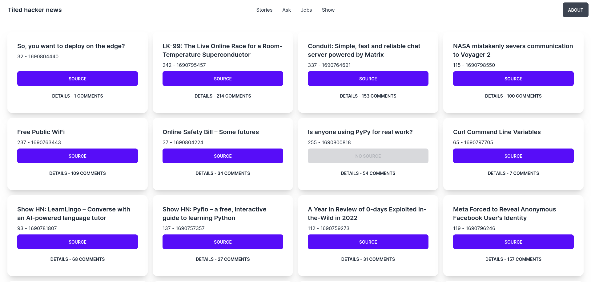

# Tiled Hacker news on [Remix](https://remix.run/)



## Requirements

Docker, Podman or Redis installed locally.

If you have Podman or Docker just bring up the docker-compose.yml

## Install intructions

```
pnpm i
pnpm dev
```

## Description

It uses [FxTS](https://fxts.dev/) to concurrently get news details & comments.

[Zod](https://zod.dev) is used to validate the structure of the data returned by the API. It also recursively parse comments.

News/stories/comments are cached in Redis.

Pagination to come...

## Files of interest

- app/models/api.server.ts
- app/models/apitype.server.ts
- app/models/cached-api.server.ts
- app/routes/index.tsx
